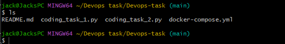
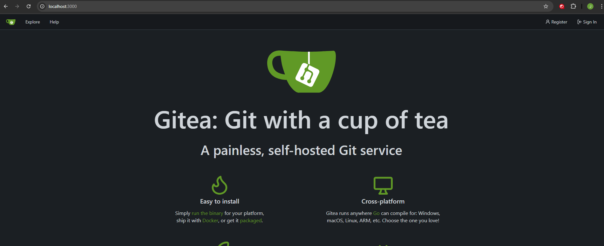
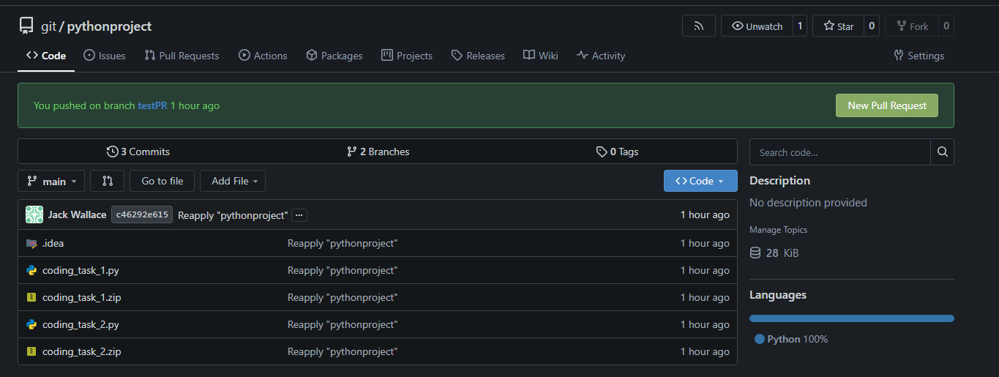
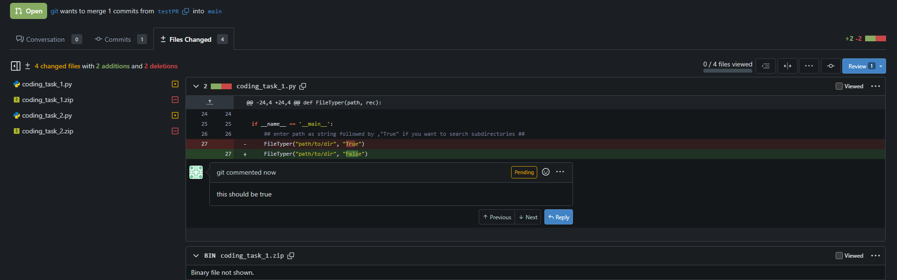
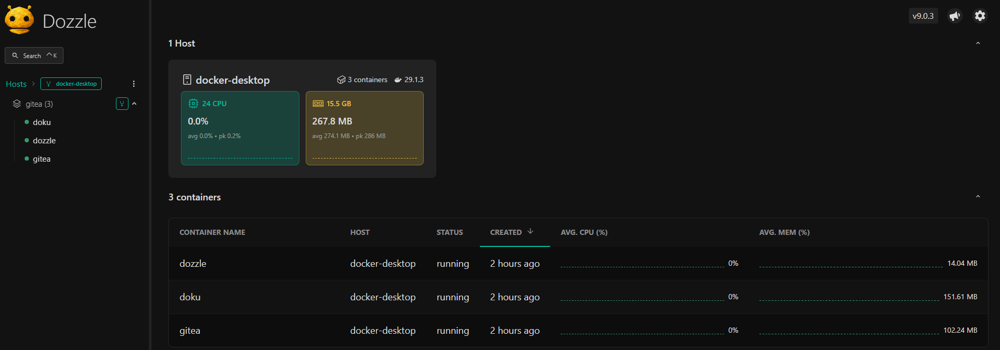
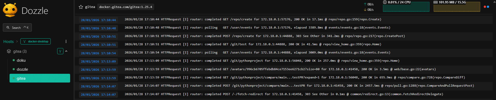
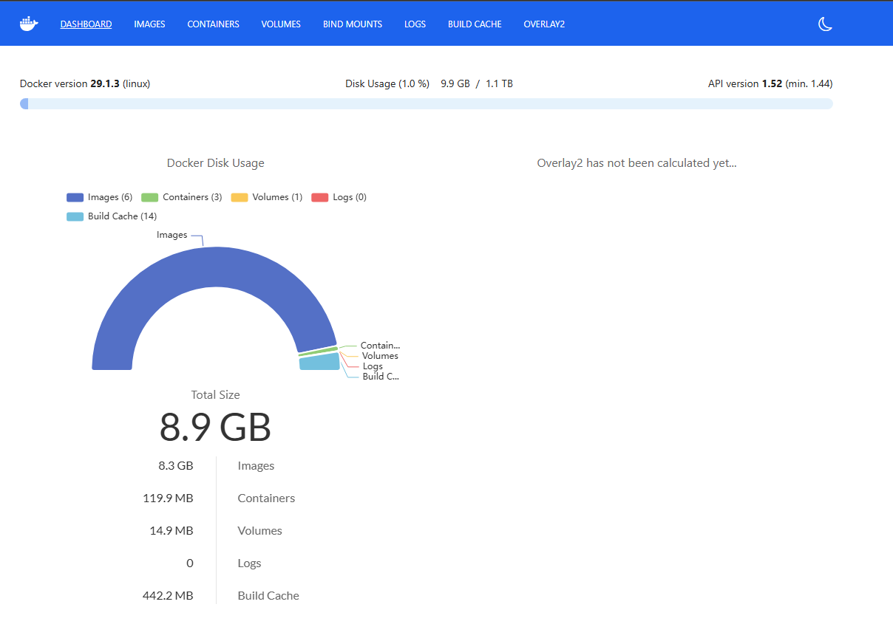
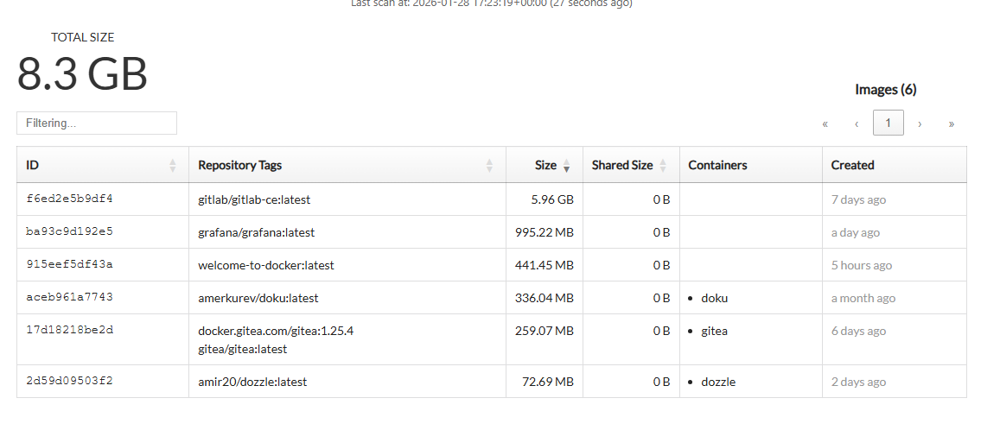

# Devops-task

## Github alternatives

I researched three github alternatives that would meet the requirements - self-hosted git repositories and ability for code review.
The three I found were Gitlab, Gitea and Bitbucket.

### Gitlab

[Gitlab](https://about.gitlab.com/)
Gitlab has the most features (it can do more than Github) including having in built CI/CD and Docker registry for storing Docker images. The downside is that it requires almost 10 gb of space to host, aswell as needing significant setup and boot up time in docker. It also has some paid features including for many integrations and extra storage.

### Gitea

[Gitea](https://about.gitea.com/)
Gitea has almost identical features to Github (git clone, PRs, actions etc) with the same layout. It is completely free and storage is defined by the host machine. It does not however have integrated CI/CD so an external pipeline system would be needed (I.E. Jenkins). Jenkins does have a Gitea plugin however so setup is simple.

### Bitbucket

[Bitbucket](https://bitbucket.org/product/)
Bitbucket is made by Atlassian and provides extremely good integration with their other products (Jira, Confluence etc). It again does have some features blocked through paid subscription (storage being a significant one), but code reviewing and pipelines are available for free.

## Choice

I decided to use Gitea primarly because it has all the features required (self-hosted git repositories, code review, pull review interface) for free and is much more compact than the other options. If the company already uses Atlassian products Bitbucket may be a better choice as the Jira ticket integration is very useful, or if they want the most CI/CD capability Gitlab may be the best.

## Gitea Setup

### Prerequisites
- Docker
- Git

This setup is to self-host Gitea in a Docker container. I chose to create a `docker-compose.yml` file as it is an easy and repeatable way to deploy multiple containers, this meant i could also deploy monitoring applications at the same time.

To deploy Gitea you can clone the existing docker compose file [here](/docker-compose.yml). Then navigate to the cloned folder in a terminal.


Once here you need to compose the file with the following command:
```
docker-compose up
```
This will download the Gitea image specified in the file and then run the image with the options listed.

Once completed navigate to `localhost:3000` and you will see the Gitea homepage


Create an account and sign in and then you will be able to start or push a repository in normal git fashion for your command line, example:
```
git init
git add .
git commit -m "initial commit"
git remote add origin http://localhost:3000/git/test.git
git push -u origin main
```
Here is an example of a repository I pushed to Gitea: 


Pull requests can be made from branches and reviewed in the same way as Github, with required reviewers and ability to add comments:


## Monitoring

Some open-source docker container monitoring applications are included in the docker-compose file. 
Dozzle which shows containers running on each host, CPU and memory usage and individual logs from each container.


Doku which shows the size used in the docker disk by all docker components and individual breakdowns of each component.




Both these apllications get their information from the docker socket, meaning they monitor docker directly and dont need external setup.